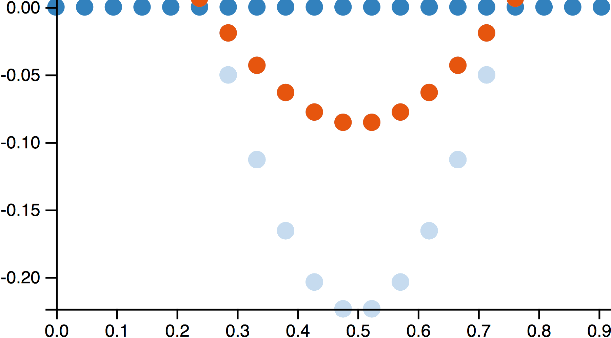
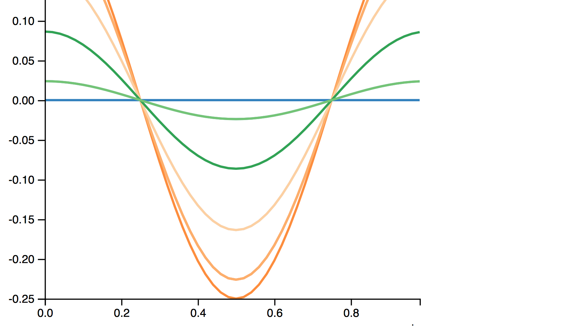
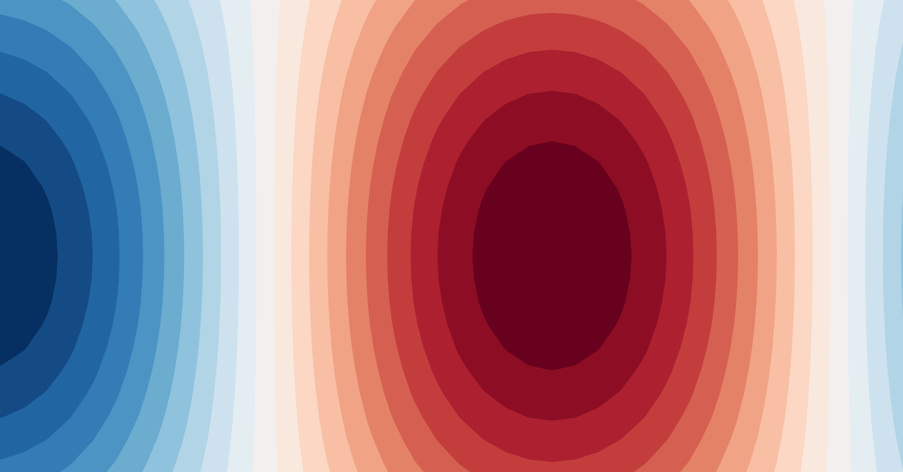
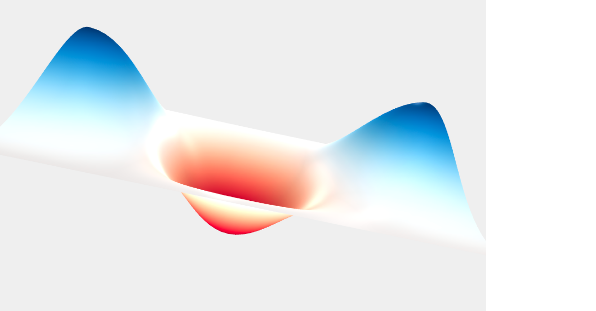
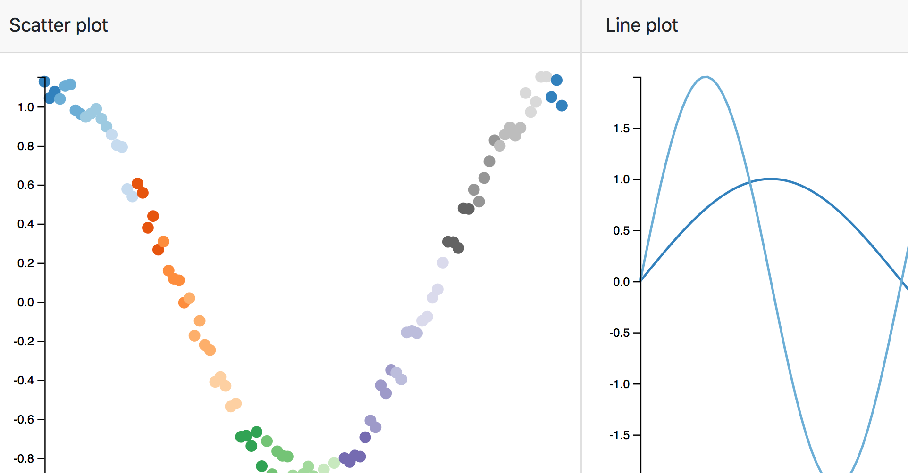

# Examples

## **dbslice** sessions

<table>
<tr>
	<td></td>
	<td></td>
	<td></td> 
</tr>
<tr>
	<td><a href="http://dbslice.org/demos/testbox">Testbox demo</a></td>
	<td><a href="http://dbslice.org/demos/comp3stg">Compressor demo</a></td>
	<td><a href="http://dbslice.org/demos/ukrivers">UK rivers demo</a></td>
</tr>
</table>

## Plot functions

<table>
<tr>
	<td></td>
	<td></td>
	<td></td> 
</tr>
<tr>
	<td><a href="http://bl.ocks.org/grahampullan/40b82b8d605c6689c997e736a198aed6">Scatter plot</a></td>
	<td><a href="http://bl.ocks.org/grahampullan/6c79f396a87ff386ef56fa6dde170cb0">Line plot</a></td>
	<td><a href="http://bl.ocks.org/grahampullan/806086a83b8e2471a08576a009c38ba3">Contour plot</a></td>
</tr>
</table>

<table>
<tr>
	<td></td>
	<td></td>
</tr>
<tr>
	<td><a href="http://bl.ocks.org/grahampullan/0e751f3c2f11f3befd94d2690cce6ab7">Surface plot</a></td>
	<td><a href="http://bl.ocks.org/grahampullan/e0ac9efe230b0cbf0eb5742598f8643a">2 plots session</a></td>
</tr>
</table>

## Crossfilter-linked plot functions

<table>
<tr>
	<td></td>
</tr>
<tr>
	<td><a href="http://bl.ocks.org/grahampullan/8569646fadc2fb74026e22b04539f339">3 filter plots session</a></td>
</tr>
</table>

